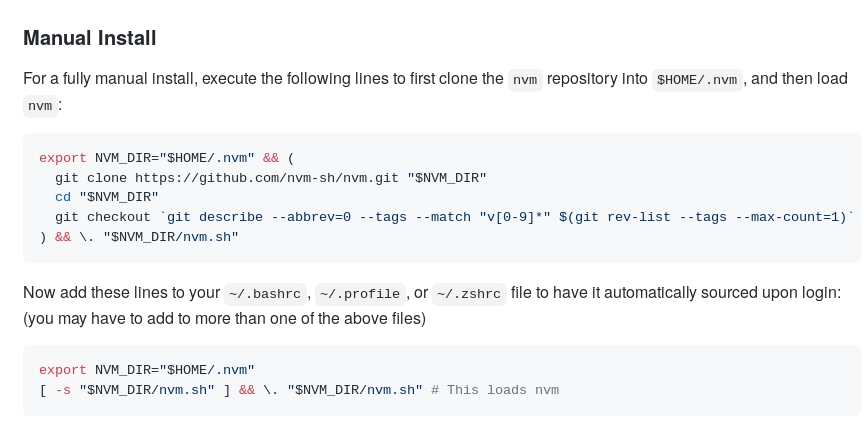

# EDIBO:shipit:
EDIBO projekta paka

http://tsugi.sakai.lv/portal/site/e4fe3414-6bcf-4bfb-856d-f2281f98ab79/page/50fe20e4-1143-48af-800b-f4cf70edffc6?sakai.state.reset=true

[formatēšanas piemēri github](https://help.github.com/en/github/writing-on-github/basic-writing-and-formatting-syntax)

http://htmlpreview.github.io/

export NVM_DIR="$HOME/.nvm" && (
  git clone https://github.com/nvm-sh/nvm.git "$NVM_DIR"
  cd "$NVM_DIR"
  git checkout `git describe --abbrev=0 --tags --match "v[0-9]*" $(git rev-list --tags --max-count=1)`
) && \. "$NVM_DIR/nvm.sh"

nvm i 12

nano bash.rc ==> shift+g ==>   export NVM_DIR="$HOME/.nvm"
[ -s "$NVM_DIR/nvm.sh" ] && \. "$NVM_DIR/nvm.sh"

~/.bashrc
