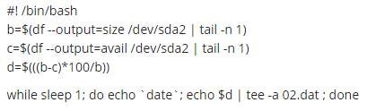

Assignment screenshot
displays system usage each second
///////////////////////////////////////////////////////////////////////////////////////////////////////

///////////////////////////////////////////////////////////////////////////////////////////////////////

// notes

cd -  => previous dir

ls -l /etc/alternatives/vi  ==> find connected links

df -disk free space
kbs - default size
-m - mbts
-h - human, gbts

du - disk usage

df -h | grep dev

man grep 
/for - slash to search in man

grep awk sed --> useful text processors

gnuplot for text visualization

