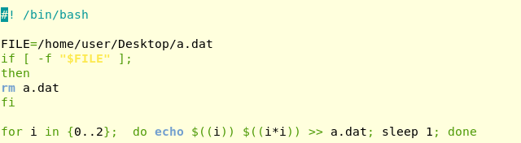
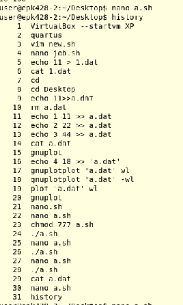

day 5 notes

grep sed awk

cat a.dat
more a.dat
less a.dat
head a.dat
tail a.dat

echo 11 > 1.dat
echo 22 >> 1.dat
echo 33 >> 1.dat

rm a.dat

ls
cd

plot 'a.dat'
plot 'a.dat' wl lw4

chmod 777 ./a.sh
./a.sh
nano a.sh
