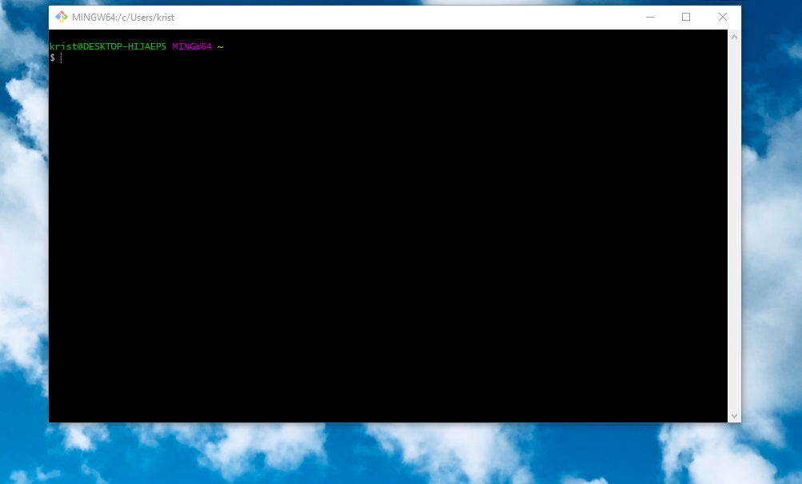

:shipit:

Python

vars()
a = 10
type = 0

ipython

a. + [tab] --> view methods
print(a.__doc__) --> print documentation

idle & --> file -> save as

nano first_python_script.py

chmod 740 -"-

python -"-

./first_python_script.py

mkdir 20200709
touch a.dat

cat a.dat

echo  1 > a.dat ===> size 2
printf A > a.dat ===> size 1 ===> print does not put char on new line ! less memory, with echo there is hidden "/n"

hexdump a.dat
hexdump -z a.dat
-b, -c, -C, -d, -x

curl google.com

curl google.com | hexdump | less

///// Calculations //////

type(s2) ===> int

s2 = str(s2)

a = 123

a = 123 // 61

a % 2 = 1

z = complex()
type(z) ==> complex

z
0j

type(3.14e-13)

c=(11,22)
type(c)

tuple --> can't edit

dir(c) ---> shows all available methods

c.count()

print(c.index.__doc__)

c[0]
c[-1] ---> last entry

c= [22,3.14, 'Edibo', 3+4j]
type(c) => list

print(dir(c))

c.sort[reverse=True]

c.append(22)

c.pop()

c.pop(5) -- index

c.remove("Edibo") -- value

d = {}

type(d) => dict

d = {'abols':'apple'}

d['abols']

d.update({"bumbiers":"birne"})

print(d.pop.__doc__)

d.pop('abols')

chaining example:

d['mylist'][-1].lower()
